# AHP（层次分析法）
与决策相关的方法，当进行选择的时候，有多个指标影响决策结果，可以对各个决定指标的重要性进行评估，也就是确定各个指标的权重，**可以无需客观数据**，同时可以量化方案的选择，根据评分来选择最佳的方案。

# 分析过程
简单地说，层次分析法就是将一个决策事件分解为目标层（例如选择旅游地），准则层（影响决策的因素，例如景色、交通、费用等）以及方案层（指的是方案，例如去广州、桂林等地旅游）

层次分析法应用过程中，大体步骤主要包括四个。第一步是层次结构模型的构建。第二步构造判断矩阵，第三步为层次单排序及其一致性检验，这步即为对指标定权，第四步为层次总排序及其一致性检验

一致性检验的含义用于确定构建的判断矩阵是否存在逻辑问题，例如以A、B、C构建判断矩阵，若判定A相当于B为3（A比B稍微重要），A相当于C为1/3（C比A稍微重要），在判断B相当于C时，根据上述的逻辑，理应C比B重要，若我们在构建判断矩阵时，错误填写为B相当于C为3（B比C稍微重要），那么就犯了逻辑错误。

## 构建层次评价模型
在这个层次评价模型里面，我们需要确认整个决策事件的目标层、准则层、方案层

例如

目标层：最优旅游地选择（决策目标）

准则层：景色、费用、居住、饮食、旅途（影响决策的因素）

方案层：西安、云南、西藏、青海（最终选择方案）

准则层如果有多层，例如下图所示，依次类推就行了。

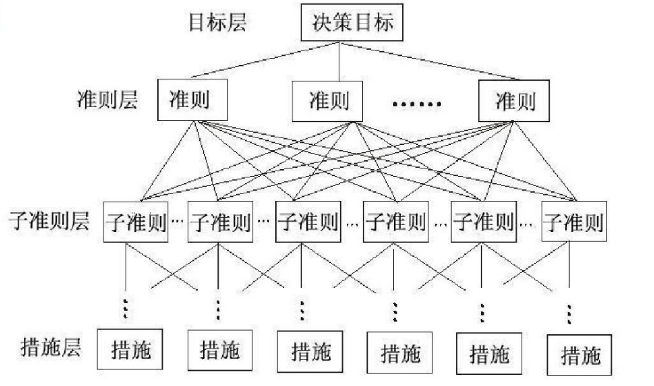

## 构造判断矩阵
构造判断矩阵就是通过各要素之间相互两两比较，并确定各准则层对目标层的权重，相当于确定各个要素的权重，确定哪个要素更加重要

简单地说，就是把准则层的指标进行两两判断，通常我们使用Santy的1-9标度方法给出

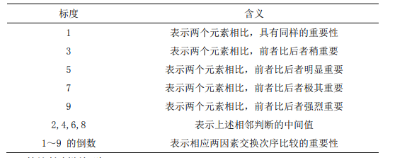

对于一个准则层A，构建一个判断矩阵

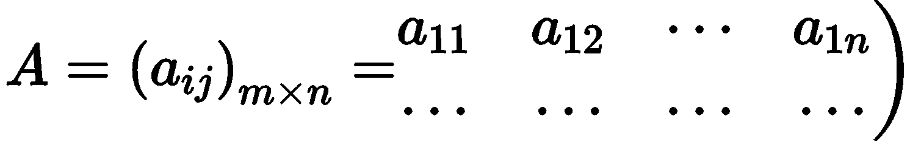

元素满足以下关系

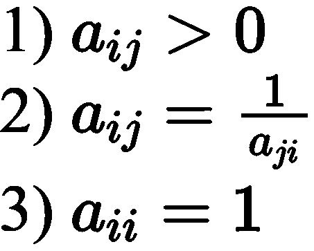

例如对于准则层：景色、费用、居住、饮食、旅途，我们可以构建这样一个5*5的判断矩阵：
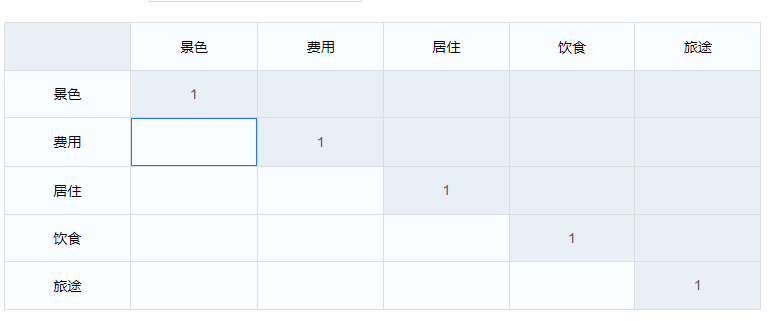

这里的重要性值是采用行比上列来实现的。

例如对于【景色】与【景色】，其重要性为1，因为肯定是指标自身对比自身肯定是1：1。对于第二行第一列，也就是【费用】与【景色】对比，可能我认为【费用】比【景色】明显重要，那么就可以标值为5
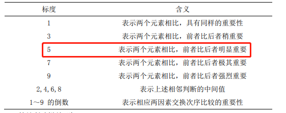

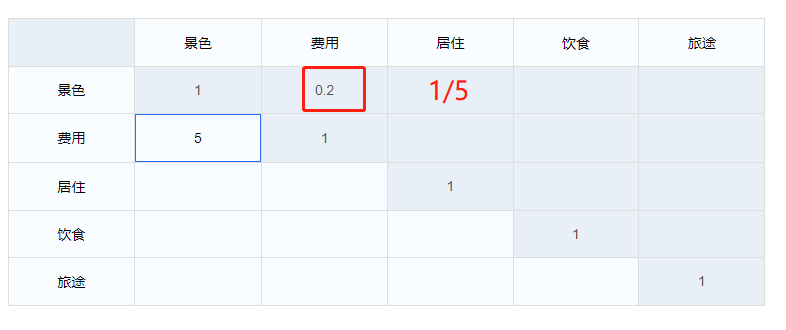

## 层次单排序与一致性检验

### 层次单排序
层次单排序就是根据我们构成的判断矩阵，求解各个指标的权重
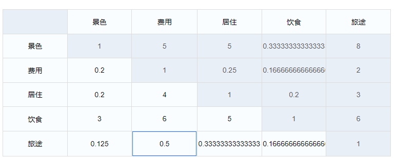
那么我们可以计算其权重（权重向量），有两种方式，一种是方根法，一种是和法。

- 方根法：
1、计算每行乘积的m次方，得到一个m维向量（一个列向量）
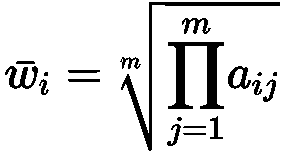
也就是

2、将这个向量标准化为权重向量
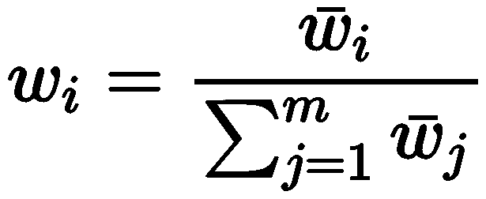
也就是用对应的行来比上列向量中所有行的值的和
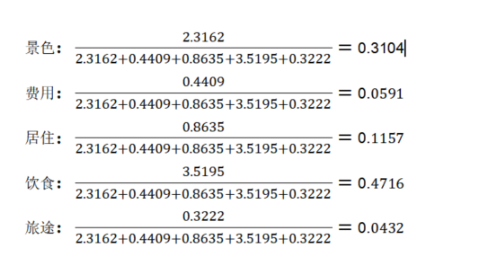

- 和法

1、先将矩阵的每列进行标准化

这里标准化的意思是用相应的值来除以每列的和

2、将标准化后的各元素按行求和

3、将求和结果进行标准化，也就是除以这列的和

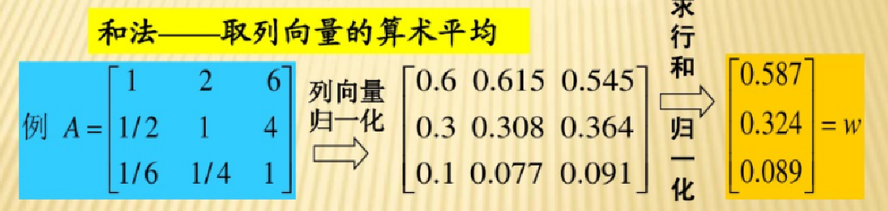

### 求解最大特征根与CI值

以上，求得权重矩阵后，可以计算最大特征根，其公式为：
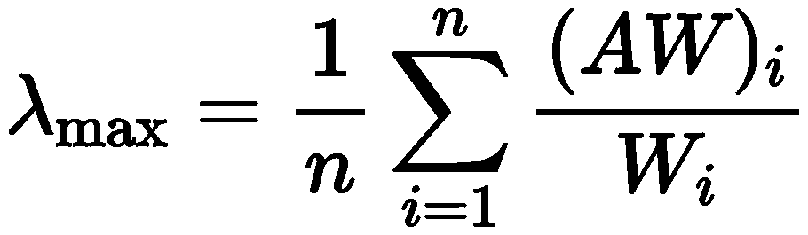
其中n为维度数，例如构建的判断矩阵为：景色、费用、居住、饮食、旅途时，n=5；

w为权重向量

AW为：判断矩阵标准化后的权重，然后按行的累加值。

原始的判断矩阵A为：
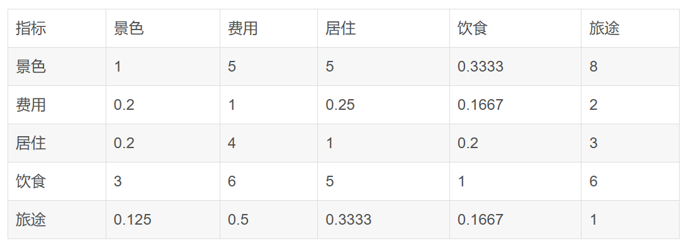
标准化后权重W为：
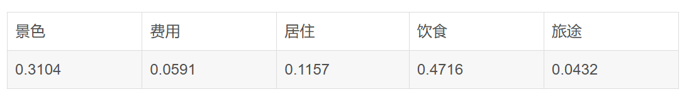
然后用标准化后的权重填表，计算得到新的判断矩阵A*W为：
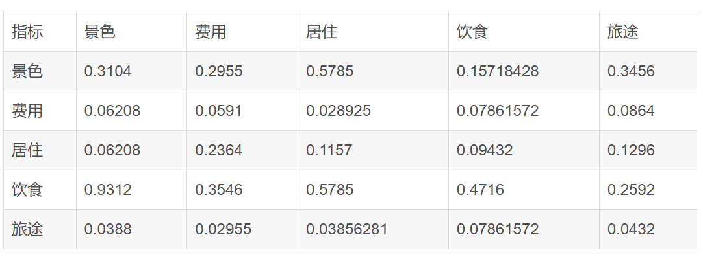
这里$a_{ij}$为权重矩阵中对应的$a_i:a_j$
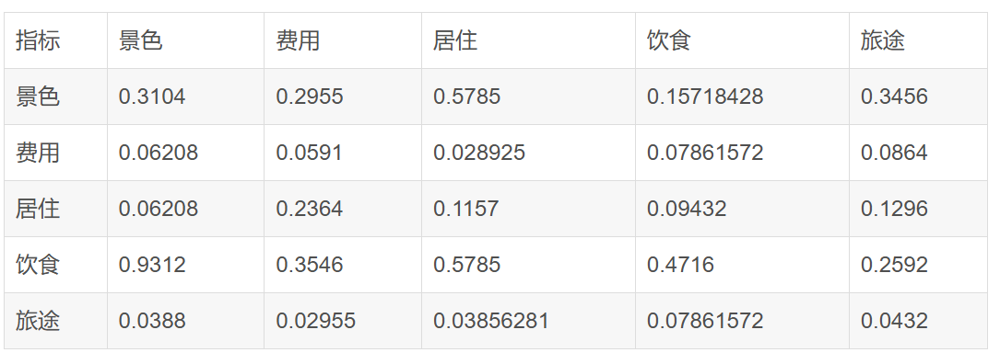
AW：每行的求和得到的向量
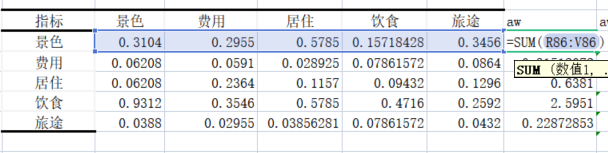
$$
λ_{max} = \frac{\frac{AW_1}{W_1}+\frac{AW_2}{W_2}+\frac{AW_3}{W_3}+···+\frac{AW_n}{W_n}}{n}
$$

计算得到一致性指标CI（Consistency Index）
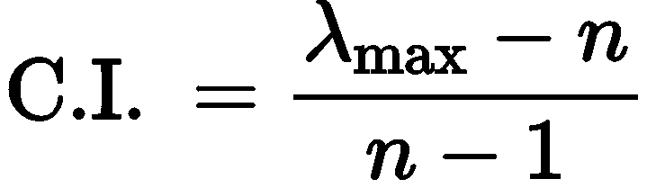

### 根据CI、RI求解CR值，判断一致性是否通过
这里的一致性可以理解为，当最初按照主观想法填表时，我们比较的是两两之间的重要性关系，然而当A与B、B与C之间进行比较后，A与C的关系可以按照理论公式算出值，这个算出的值可能与我们按照主观填写的A与C的位置的值不一样，我们可以在一定的范围内容忍不一样，这就涉及到一致性检验，若在范围内，则通过。

RI值通过查表得到
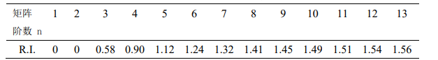

CR通过公式计算得到
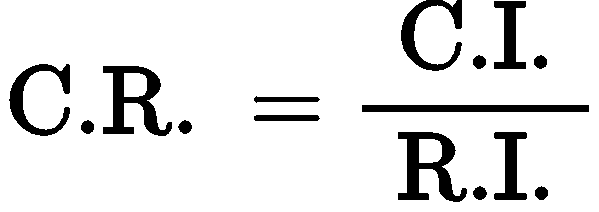

CR<0.1，则可以接受

所以C.R.<0.1时，表明判断矩阵A的一致性程度被认为在容许的范围内，此时可用A的特征向量开展权向量计算；若C.R.≥0.1, 说明我们在构建判断矩阵时出现了逻辑错误，需要对判断举证进行修正
## 层次总排序
之前我们通过主观感受得到了各个指标之间的重要性权重，这是将指标从主观量化为数据，现在我们需要对各个方案进行打分，举例来说我们现在需要决定去哪个地方，然后我们按照之前的准则层的方法主观的对目标层按照一个准则一个表来进行打分，再量化

通过类型层次单排序的方法来给方案打分
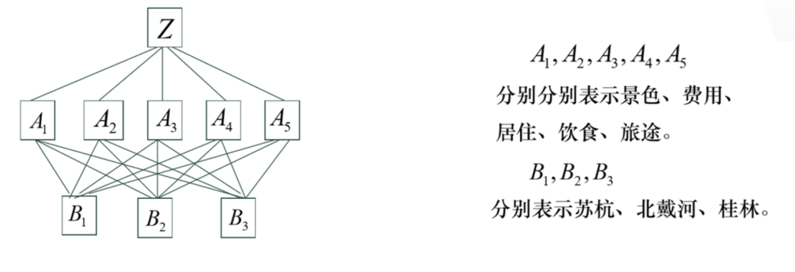
现在确定了A1~A5的权重为
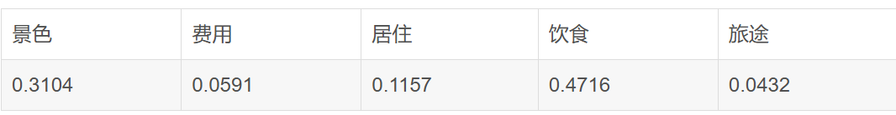
类似2.3的层次单排序，对于景色这个因素，我们可以构建一个3*3的矩阵，这里按照主观对三个地区进行构建判断矩阵
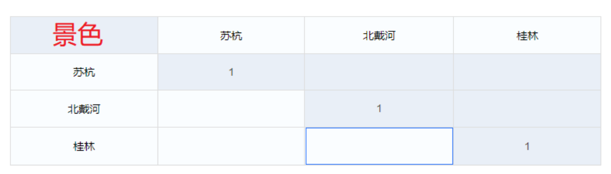

依次类推，我们构造得到苏杭、北戴河、桂林在景色上的得分矩阵A1，在费用上的得分矩阵A2，在居住上的得分矩阵A3，在饮食上的得分矩阵A4，在旅途上的得分矩阵A5，各个准则上都构建一个判断矩阵。
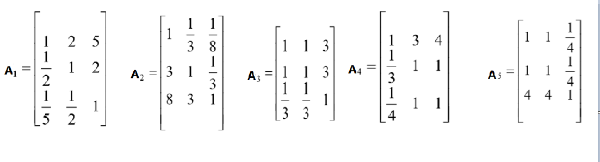

进行一致性检测后再计算得到各个权重，可以理解为各个地区在某个指标的得分，比如$B_1$在$A_1$的得分为0.5954
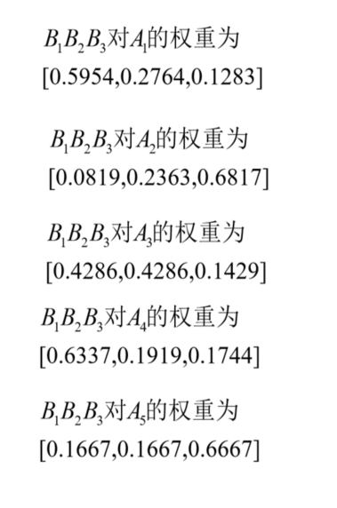

那么对于方案B1（苏杭），它的总得分为：

苏杭在景色上的得分\*景色的权重+苏杭在费用上的得分\*费用的权重+苏杭在居住上的得分\*居住的权重+苏杭在饮食上的得分\*饮食的权重+苏杭在旅途上的得分\*旅途的权重=0.5954\*0.3104+0.819\*0.0591+0.4286\*0.1157+0.6337\*0.4716+0.1667\*0.0432=0.5889

选择最高得分的方案

综上所述，层次分析法其实就是根据自己的主观看法来对方案进行量化打分的一种建模方法，我们需要根据最终的目标得分来进行方案的选择，在进行主观判断后需要及时对判断矩阵进行一致性分析，确保主观判断时不会出现逻辑性错误，然后得到各个决策因素的打分，若有多层，则高层的决策分数由低层的决策权重\*得分来得到，决策层得到的都是决策权重，相当于确定哪个因素更重要，然后目标层就是主观的孰强孰弱，不同的目标在不同的方面是有不同的得分的，对应方面的得分\*重要程度可以得到一个综合的结果，这就可以作为评估方案的标准。