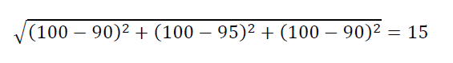
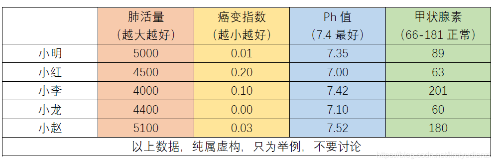
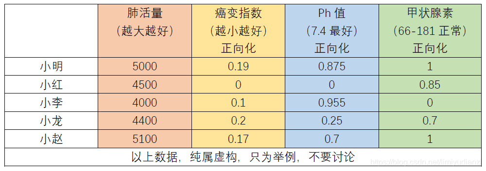
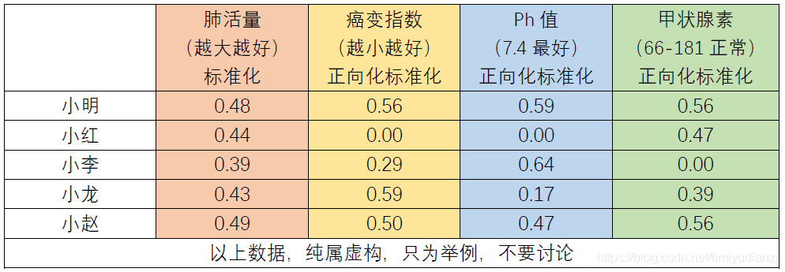

# Topsis
优劣解距离法，根据现有的数据对个体进行评价排序，通常在有量化的指标的情况下进行。

## 基本原理
求解距离来进行判断

一个指标，到该指标的最优解的距离越小说明越好当数据是多个维度的时候，比如说有好多次的成绩，有月考成绩，期中考试成绩，期末考试成绩。那么为了知道谁的分数最好，我们就可以计算在三维上，成绩到最好成绩之间的距离作为指标，距离越近说明成绩越好。比如你的成绩是（90,95,90），最好的成绩是（100,100,100）那么你到最好的成绩之间的距离就是：

距离越小，说明到最优的距离越小，也就越好

这是基本的思想，然而现在对于不同的数据，有不同的判断最优值的标准

由此我们需要进行一定的处理，将不同的类型的数据进行统一尺度下的评判

## 数据正向化
有的数据是越大越好，有的数据是靠近某个值越好，有的是在一个区间中最好，这种不同的方向和区间让分析变得混乱，为了简化分析我们将数据进行正向化处理，都让它越大越好。通常来说，常见的数据可以分为四类：

- 极大型指标（效益类指标）：指标数值越大越好。
- 极小型指标（成本类指标）：指标数值越小越好。
- 中间型指标：指标数值越接近某个值越好。
- 区间型指标：指标数值在某个区间范围内最好，区间中的数值大小无优劣之分。
为了将其余三种指标正向化，我们可以采用如下的策略，假如一个指标的所有数据记为$\mathbf{x}$，其中的元素记为$x_i$：

### 极小值转化为极大值指标
$$
\bar{x_i} = max(\mathbf{x})-x_i
$$

### 中间型指标转化为极大值指标
$$
\bar{x_i} = 1-\frac{\vert x_i-x_{best} \vert}{max(\vert \mathbf{x}- x_{best} \vert)}
$$

### 区间型指标转化
$$
\bar{x_i} = \begin{cases}
1-\frac{a-x_i}{M},x_i>a\\
1,a<x_i<b\\
1-\frac{x_i-b}{M},x_i>b
\end{cases}
$$
其中$M = max \{a-min(\mathbf{x}),max(\mathbf{x})-b\}$

## 标准化
为了将量纲统一，不引入量纲的数据影响，需要对数据进行标准化

$$
z_i = \frac{x_i}{\sqrt{\sum^{n}_{i=1}x^2_i}}
$$

## 评分构建
经过了正向化和标准化的修正之后，剩下的步骤就是进行评分指标的构建，构建的方法也很易懂，第一步是寻找各个指标的最大值和最小值，比如在肺活量中，最大的值是0.49最小是0.39； 癌变指数最大是0.59，最小是0.00； Ph值最大是0.64，最小是0.00； 甲状腺素最大是0.56，最小是0.00；联合这些不同的指标，我们就能构建一个多维的最大值的指标{0.49, 0.59, 0.64, 0.56} 和多维的最小值的点{0.39, 0.00, 0.00, 0.00}，这两个集合分别被称为最优方案，和最差方案或者叫最劣方案，回顾这个topsis方法的中文名字：优劣解距离法，我们就知道最终的评分是用一个样本到最优和最劣解的距离定的，其中到最优解的距离记为D+，到最劣解的距离记为D-，最终的评价指标C就是
$$
C = \frac{D^-}{D^++D^-}
$$
其中C越接近于1，就说明这个更优。最后根据C从大到小的顺序，评价各个参选人的优劣

这样的计算我们发现了一个问题，就是并没有加入权重系数，我们按照如上方法计算距离的时候是假定各个因素对于最终的评价都是等价的，没有重要性之分，然而实际上这是不可能的，所以我们需要引入权重。

权重的确定由其他章节来进行，这里我们假设我们得到了各个因素的权重用$w_i$表示

$$
D^+ = \sqrt{w_1 \times d_1+\dots + w_4 \times d_4}
$$